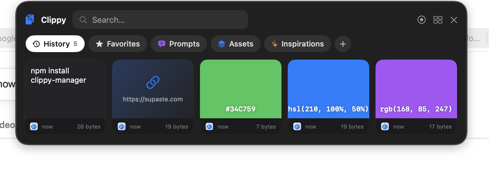
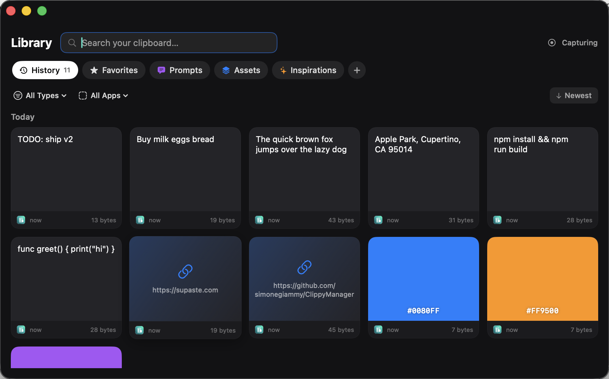
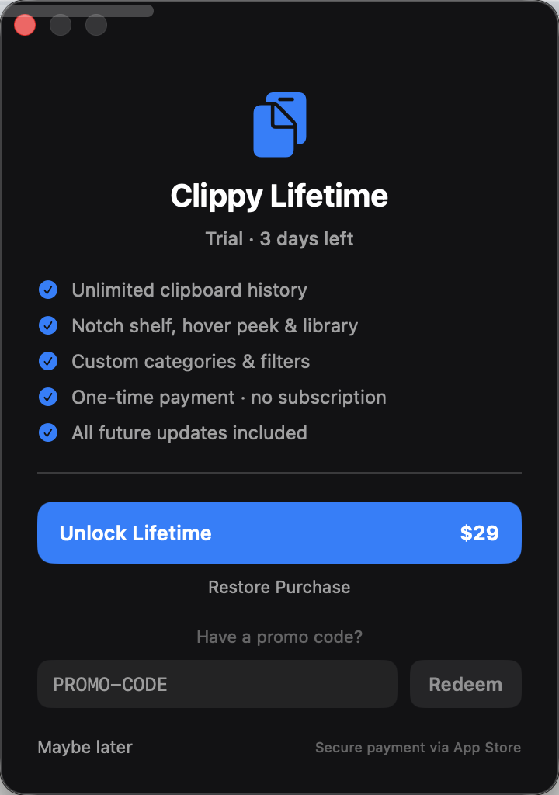

# ClippyManager

A beautiful, privacy-first **visual clipboard manager** for macOS. Lives in your menu bar and at the notch — remembers everything you copy as a searchable, glassmorphic timeline of cards.

> Inspired by the lovely [Supaste](https://www.supaste.com). Independent, open-source, built from scratch.


---

## The notch shelf

Press **⌃⌘V**, **hover the notch**, or **drag something onto it** to open a dark glass shelf of your recent clips — right under the notch, over any app. Opened by hover, it peeks and auto-retracts when the mouse leaves. (Toggle hover from the menu-bar icon.)



## The Library

A full visual library: search, filter by type or source app, organize into custom categories, grouped by day.



---

## Features

| | Feature |
|---|---|
| 🗂️ | **Visual card timeline** — every clip as a card with preview, source-app badge, timestamp & file size |
| 🪟 | **Notch shelf** — floating dark-glass panel under the notch (⌃⌘V) |
| 🖱️ | **Hover to peek** — move the mouse to the notch (no drag) and the shelf opens; it auto-closes when you leave |
| 📚 | **Library window** — full grid, date-grouped (Today / Yesterday), with a detail pane |
| 🏷️ | **Custom categories** — Prompts, Assets, Inspirations… create your own with icon + color |
| 🔎 | **Instant search** + **type filters** + **source-app filters** (Safari, Figma, Slack…) |
| 🎨 | **Color detection** — HEX, RGB, RGBA, HSL, HSLA → live color swatches |
| 💻 | **Code detection** — multi-line snippets with monospace preview & language hint |
| 🔗 | **Link detection** — gradient link cards, open or copy |
| 📸 | **Screenshot history** — screen-sized clipboard images auto-tagged as screenshots |
| 🫳 | **Drag in** — drop images/files/text onto the notch to save them manually |
| ✊ | **Drag out** — drag any card straight into another app |
| ⭐ | **Favorites** — star the clips you reuse most |
| ⌨️ | **⌃⌘0–9** — paste one of your last 10 clips without opening a window |
| 🔒 | **Sensitive detection** — passwords, cards, tokens & JWTs are masked |
| ⏸️ | **Pause capture** — stop recording with one click |
| 🛡️ | **Private by design** — 100% local, no cloud, no tracking, no analytics, App Sandbox |

---

## Licensing (dormant)

ClippyManager ships with a **3-day free trial → one-time lifetime unlock** flow
that is **switched off by default** — the app is fully usable. The scaffolding is
ready so you only need to wire the App Store product and flip one flag.



**To go live:**
1. Create a **Non-Consumable** IAP in App Store Connect with id
   `com.giammy.clippymanager.lifetime` (see `LicenseManager.lifetimeProductID`).
2. Set `LicenseManager.enforcementEnabled = true` (or launch with
   `--enforce-license` / env `CLIPPY_ENFORCE_LICENSE=1` to test).
3. Done — after 3 days the shelf/library show an **Unlock Lifetime** prompt;
   `StoreManager` (StoreKit 2) handles purchase + restore.

**Promo codes** work offline today via the Unlock screen. Codes are matched by
**SHA-256 hash** (plaintext never ships in the binary) and can only be redeemed
once per device. Add your own in `LicenseManager.promoCodeHashes`:

```bash
printf '%s' "YOUR-CODE" | shasum -a 256   # add the hash to the set
```

The trial countdown (`firstLaunchDate`) is recorded from first launch regardless,
so enabling enforcement later is seamless.

## Keyboard shortcuts

| Shortcut | Action |
|---|---|
| `⌃⌘V` | Open / close the notch shelf |
| `⌃⌘0` … `⌃⌘9` | Paste the Nth most-recent clip into the frontmost app* |

\* Inline paste simulates ⌘V and needs Accessibility permission; otherwise the clip is placed on the clipboard for you to paste manually.

---

## Requirements

- macOS 14.0 (Sonoma) or later
- Xcode 15+ to build from source

## Building from source

```bash
git clone https://github.com/simonegiammy/ClippyManager.git
cd ClippyManager

brew install xcodegen      # project is generated from project.yml
xcodegen generate
open ClippyManager.xcodeproj   # then ⌘R
```

Command-line build (unsigned, dev only):

```bash
xcodebuild -scheme ClippyManager build \
  CODE_SIGN_IDENTITY="" CODE_SIGNING_REQUIRED=NO CODE_SIGNING_ALLOWED=NO
```

Handy debug launch flags: `--open-shelf`, `--open-library`.

---

## Architecture

```
ClippyManager/
├── AppDelegate.swift            # Menu bar + notch shelf panel + library window + hotkeys
├── Models/
│   ├── ClipItem.swift           # @Model: type, content, source, size, sensitive, category…
│   ├── ClipItemType.swift       # text / link / code / color / image / file / screenshot
│   └── Category.swift           # user-created categories
├── Services/
│   ├── ClipboardMonitor.swift   # NSPasteboard polling → classify, size, sensitive, screenshot
│   ├── ContentClassifier.swift  # link / color (hex+rgb+hsl) / code detection
│   ├── SensitiveDetector.swift  # password / card / token / JWT heuristics
│   ├── SourceAppTracker.swift   # frontmost-app capture + icons
│   ├── ClipFilter.swift         # shared search / tab / type / app filter state
│   ├── DropIngestor.swift       # manual drop-to-save ingestion
│   ├── PasteService.swift       # copy + optional ⌘V auto-paste
│   ├── HotKeyManager.swift      # Carbon ⌃⌘V + ⌃⌘0–9 (sandbox-safe)
│   ├── LicenseManager.swift     # 3-day trial + promo codes (dormant by default)
│   ├── StoreManager.swift       # StoreKit 2 lifetime IAP (scaffolded)
│   └── StorageManager.swift     # SwiftData container, categories, pruning
├── Views/
│   ├── Theme.swift              # dark glassmorphic design system
│   ├── CardView.swift           # the clip card (preview + source + time + size + drag)
│   ├── ShelfView.swift          # horizontal notch shelf
│   ├── LibraryView.swift        # full grid library
│   ├── DetailPaneView.swift     # preview + metadata + copy
│   ├── CategoryTabsView.swift   # pill tabs + type/app filter bar
│   ├── AddCategorySheet.swift   # create a category
│   ├── UpgradeView.swift        # trial / lifetime unlock / promo code
│   └── SearchBarView.swift
└── Windows/
    ├── ShelfPanel.swift         # borderless floating panel under the notch
    └── NotchDropZone.swift      # always-on drag target that opens the shelf
```

**Key decisions**
- **Persistence**: SwiftData (`@Model`), with declaration-level defaults so lightweight migration works across schema versions.
- **Notch shelf**: a borderless `NSPanel` (`canBecomeKey`) pinned under the notch, forced dark appearance.
- **Drop-to-save**: a thin always-on `NotchDropZone` panel opens the shelf on drag-enter; the shelf's `onDrop` ingests images/files/text.
- **Global hotkeys**: Carbon `RegisterEventHotKey` — works in the sandbox without Accessibility.
- **Library**: switches the app to `.regular` activation while open (a menu-bar app needs this to show a real window), back to `.accessory` on close.

---

## Roadmap

- [ ] Inline paste polish + first-run Accessibility onboarding
- [ ] iCloud-free local encryption for sensitive items
- [ ] Widgets & menu-bar quick view
- [ ] Native screenshot capture shortcut
- [ ] App Store release

## Contributing

PRs welcome. Fork → branch → commit → PR. Please test on macOS 14+.

## License

MIT — see [LICENSE](LICENSE).

## Inspired by

[Supaste](https://www.supaste.com) by Solt Wagner. ClippyManager is an independent open-source reimplementation and is not affiliated with Supaste.
